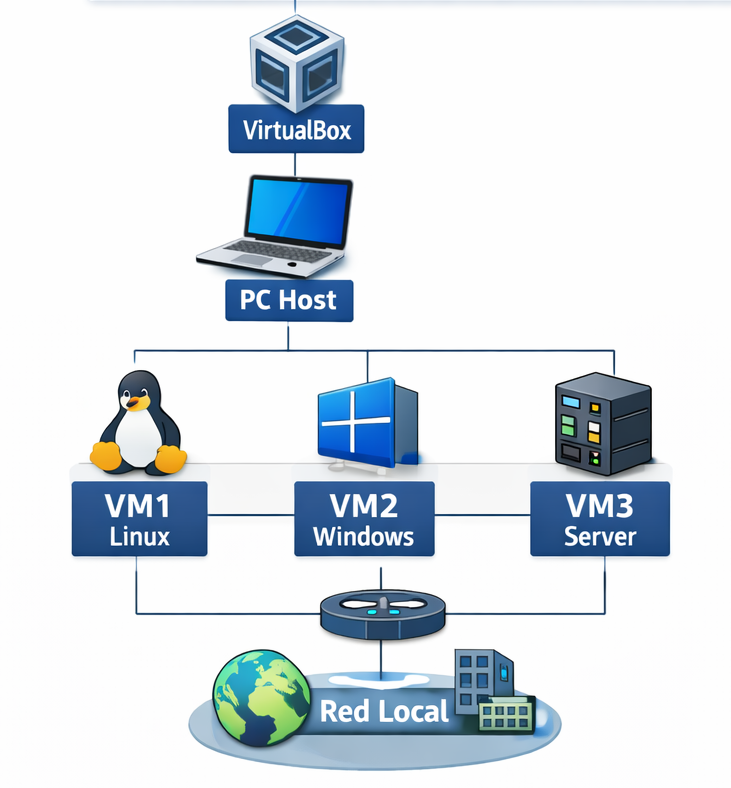
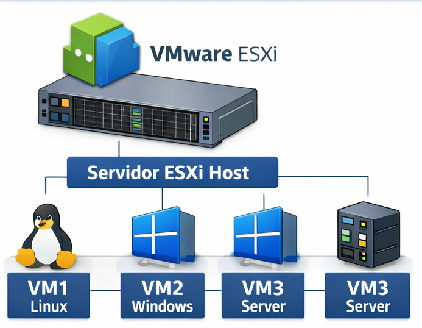

# 🚀 GNS3 + Hipervisores en Windows 11

---

## 🌐 Introducción
Este repositorio documenta la **implementación de laboratorios de red avanzados** utilizando GNS3 sobre Windows 11, integrando hipervisores tipo 1 (**ESXi**) y tipo 2 (**VirtualBox**).  
Se destacan las configuraciones críticas, problemas frecuentes y soluciones profesionales.

---

# 1️⃣ Arquitectura de Virtualización en Windows 11

## 🔒 Aislamiento de Núcleo y VBS
El **Aislamiento de Núcleo (Core Isolation)** y la **Virtualization-Based Security (VBS)** protegen el sistema mediante virtualización, pero pueden interferir con GNS3 y VirtualBox.

❌ **Problemas comunes**:
- Hyper-V activado de forma silenciosa.
- Bloqueo de VirtualBox y GNS3 VM.

✅ **Solución recomendada**:
- Desactivar **Aislamiento de núcleo**:  
`Seguridad de Windows → Seguridad del dispositivo → Aislamiento de núcleo`

---

# 2️⃣ GNS3 VM: El Motor de Simulación

## KVM (Kernel-based Virtual Machine)
KVM es una tecnología de virtualización que permite a GNS3 ejecutar dispositivos con alto rendimiento usando el kernel de Linux.

⚠️ Importante:
Debe aparecer como:
KVM support: True

Si aparece en False:
- No hay virtualización anidada
- El rendimiento será bajo

---

## Configuración de Recursos

Para evitar que Windows 11 se vuelva lento, se recomienda:

- Si tienes 8 GB RAM → asignar 4 GB a GNS3
- Usar entre 2 a 4 núcleos de CPU

Esto permite estabilidad entre el sistema host y la máquina virtual.

---

# 3️⃣ Integración con VirtualBox (Local)

## Configuración de Red (Host-Only)

Pasos:
1. Ir a VirtualBox
2. Crear un adaptador Host-Only
3. Asignar una IP (ejemplo: 192.168.56.1)
4. Conectar la GNS3 VM a esa red

Esto permite la comunicación entre GNS3 y el sistema.

---

## Modo Promiscuo

El modo promiscuo permite que una máquina virtual capture todo el tráfico de red.

Es necesario porque:
- GNS3 trabaja con switches virtuales
- Se necesita tráfico de capa 2

Configuración:
Modo Promiscuo → Permitir todo

---

# 4️⃣ Integración con VMware ESXi (Remoto)

## Arquitectura Cliente-Servidor

En este modelo:

Laptop (GNS3) → Servidor ESXi → Máquinas virtuales → Red

Esto permite que el procesamiento se haga en un servidor físico, mejorando el rendimiento.

---

## Seguridad en vSwitch

Para que GNS3 funcione correctamente en ESXi se deben configurar:

- Promiscuous Mode → Accept
- MAC Address Changes → Accept
- Forged Transmits → Accept

Estas opciones permiten el tráfico dinámico dentro de redes virtuales.

---

# 5️⃣ Troubleshooting

| Error | Causa Técnica | Solución |
|------|-------------|----------|
| KVM support False | No hay virtualización anidada | Activar VT-x en BIOS |
| Sin conectividad | Modo promiscuo desactivado | Activar "Permitir todo" |
| Error puerto 3080 | Firewall bloqueando | Abrir puertos en Windows |

---

### 🔧 Por qué asignar CPU y RAM a la GNS3 VM
- La GNS3 VM requiere suficiente RAM y núcleos de CPU para simular routers y switches sin retrasos.
- Si se asigna muy poca RAM, los dispositivos virtuales se cuelgan.
- Si se asigna demasiada RAM, Windows 11 puede volverse inestable.
- Recomendación: balancear recursos según el hardware del host.

### 🔧 Por qué habilitar Promiscuous Mode y MAC Address Changes en ESXi
- Promiscuous Mode permite que las máquinas virtuales capturen todo el tráfico de red, necesario para simulaciones de capa 2 en GNS3.
- MAC Address Changes permite que GNS3 reasigne direcciones MAC dinámicamente sin que el switch virtual bloquee los paquetes.
- Estas configuraciones aseguran que la topología funcione como si fueran equipos físicos reales.

### 📊 Diagrama 1: Topología Local con VirtualBox
 
*Este diagrama muestra cómo la GNS3 VM se conecta a VirtualBox usando Host-Only Network.*

### 📊 Diagrama 2: Topología Remota con ESXi

*Este diagrama muestra la conexión de GNS3 desde la laptop al servidor ESXi y cómo se distribuyen las máquinas virtuales dentro de la red.*

## ✅ Conclusión

Integrar **GNS3 con VirtualBox y ESXi** permite:

- Laboratorios locales seguros y rápidos.
- Entornos profesionales de alto rendimiento.
- Simulaciones confiables de redes complejas.

✨ Tu entorno estará **optimizado, estable y listo para prácticas avanzadas de redes**.

 
