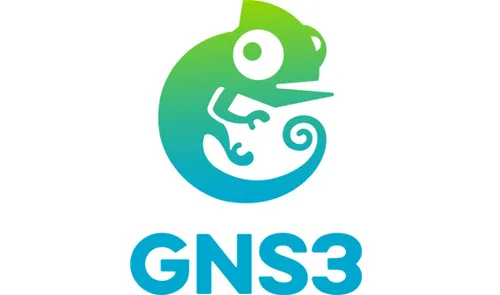

# GNS3 + Hipervisores en Windows 11


---

## Introducción
Este repositorio presenta la investigación sobre la implementación de laboratorios de red utilizando GNS3 en Windows 11, integrando hipervisores tipo 1 (ESXi) y tipo 2 (VirtualBox).

---

# 1. Arquitectura de Virtualización en Windows 11

## Aislamiento de Núcleo y VBS
El **Aislamiento de Núcleo (Core Isolation)** y la **Virtualization-Based Security (VBS)** son mecanismos de seguridad que utilizan virtualización para proteger el sistema.

🔴 Problema:
- Activan Hyper-V de forma interna
- Bloquean VirtualBox y GNS3

✅ Solución:
- Desactivar "Aislamiento de núcleo" en Seguridad de Windows

---

## Activación de VT-x / AMD-V
La virtualización por hardware debe estar habilitada en BIOS.

### Verificación en Windows:
```bash
systeminfo

